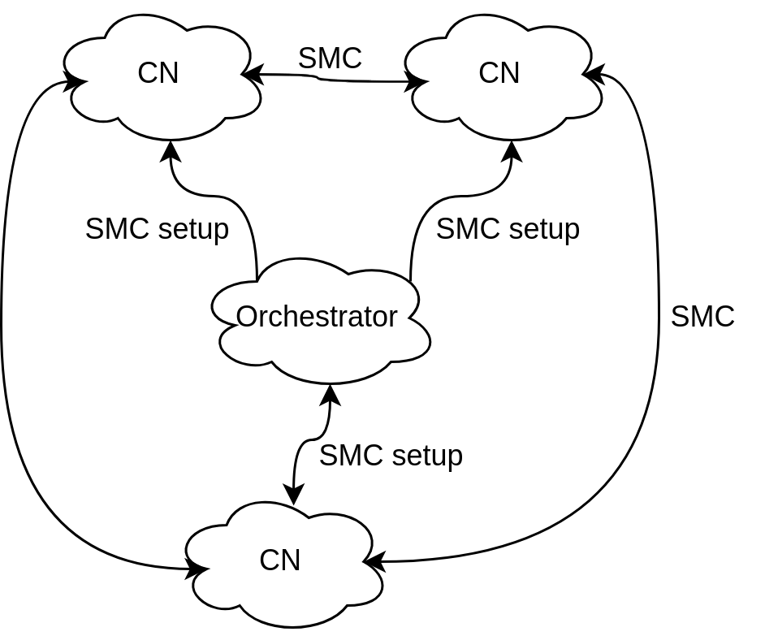

# SMC Service Generic Architecture

## Design Principles

### Privacy

Since the underlying computations aim to be performed over private data without revealing it, the same data security domain segregation must be clearly expressed in the modular architecture of the service.

### Orchestration

Simplified centralized computation orchestration without compromising data privacy.  

### Composability

Modular and replicable infrastructure.

## Architecture

  

The base architecture is composed by Computation Nodes (CN) and an Orchestrator. The primary consideration is to clearly define the security domains for private data. To each domain is assigned its own CN. 

Computations are executed between CNs without ever revealing CN-specif private data to other CNs or even to the Orchestrator. The main goal of the Orchestrator is to implement the pre-defined computation instantiation policies and setting up them in the CNs simplifying this process. It does not only have direct access to private data but also has no access to the results of the computations.

### Computation Node

The CN is the sole component with access to its own private data and manages the full logic of computation execution. It also provides interfaces for authorized users to interact with private data and view processed computation results.

The main components are:
- `CN API`: Manages computation requests between the local CN and remote CNs. Also serves as the interface for the Orchestrator.
- `Internal API`: Handles access to the CN’s private data.
- `Internal GUI`: A secure interface for authorized users to access CN-specific features, including computation inputs and results.
- `CN Core` - Performs the execution of the computations.

### Orchestrator

It designed to coordinate computations without accessing any private data. Its sole function is to manage and trigger computations between CNs based on predefined policies that consider factors like timing and node status. This design eliminates the need for complex distributed consensus mechanisms. A single Orchestrator operates within a specific control domain, managing a group of CNs.

It includes two main components:
- `Orchestrator API`: Handles the setup, instantiation, and triggering of computations according to defined policies. It exposes endpoints to change use case specific parameters.
- `Management GUI`: A graphical interface for administering and monitoring the Orchestrator.

## QKD Networks

When integrating this framework into an existing QKD Network, to each CN is associated a QKD node. The Orchestrator can be deployed on any node agreed upon by the involved entities. Hosting the Orchestrator on a QKD node is only necessary if secure communication with CNs via quantum-generated symmetric keys is required. Also, the network should be able generate and distribute oblivious keys that are retrieved by the service from the local KMS.
